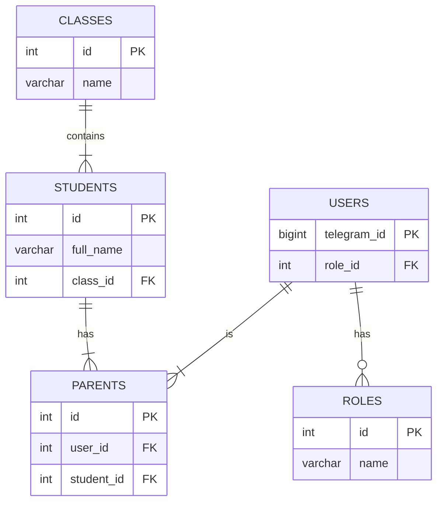

# Схема базы данных для проекта "ConsentPro"

## ER-диаграмма



## Описание таблиц

*   **roles**: Справочник ролей (`Администратор`, `Учитель`, `Родитель`).
*   **users**: Основная таблица пользователей. `telegram_id` - уникальный идентификатор пользователя в Telegram, `role_id` - ссылка на роль.
*   **classes**: Таблица классов, создаваемых учителями.
*   **students**: Ученики, привязанные к определенному классу.
*   **parents**: Связующая таблица, которая соединяет пользователя-родителя (`user_id`) с его ребенком-учеником (`student_id`).

## SQL-скрипт для создания таблиц

```sql
-- Создание таблицы ролей
CREATE TABLE roles (
    id SERIAL PRIMARY KEY,
    name VARCHAR(50) UNIQUE NOT NULL
);

-- Заполнение таблицы ролей
INSERT INTO roles (name) VALUES ('Администратор'), ('Учитель'), ('Родитель');

-- Создание таблицы пользователей
CREATE TABLE users (
    id SERIAL PRIMARY KEY,
    telegram_id BIGINT UNIQUE NOT NULL,
    role_id INT NOT NULL,
    created_at TIMESTAMP WITH TIME ZONE DEFAULT CURRENT_TIMESTAMP,
    FOREIGN KEY (role_id) REFERENCES roles (id)
);

-- Создание таблицы классов
CREATE TABLE classes (
    id SERIAL PRIMARY KEY,
    name VARCHAR(100) NOT NULL,
    teacher_id INT NOT NULL,
    created_at TIMESTAMP WITH TIME ZONE DEFAULT CURRENT_TIMESTAMP,
    FOREIGN KEY (teacher_id) REFERENCES users (id)
);

-- Создание таблицы учеников
CREATE TABLE students (
    id SERIAL PRIMARY KEY,
    full_name VARCHAR(255) NOT NULL,
    class_id INT NOT NULL,
    created_at TIMESTAMP WITH TIME ZONE DEFAULT CURRENT_TIMESTAMP,
    FOREIGN KEY (class_id) REFERENCES classes (id) ON DELETE CASCADE
);

-- Создание таблицы родителей
CREATE TABLE parents (
    id SERIAL PRIMARY KEY,
    user_id INT NOT NULL,
    student_id INT NOT NULL,
    created_at TIMESTAMP WITH TIME ZONE DEFAULT CURRENT_TIMESTAMP,
    FOREIGN KEY (user_id) REFERENCES users (id),
    FOREIGN KEY (student_id) REFERENCES students (id) ON DELETE CASCADE,
    UNIQUE (user_id, student_id)
);