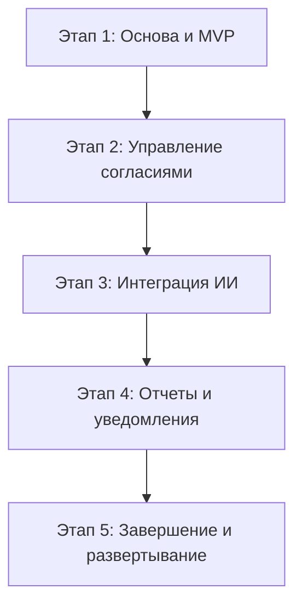

# Детальный план разработки Telegram-бота "ConsentPro"

Этот документ описывает стратегию и последовательность разработки Telegram-бота "ConsentPro". План разбит на логические этапы (спринты), что обеспечивает поэтапную реализацию и тестирование функционала.

## Визуализация этапов разработки

---

## **Этап 1: Основа проекта и базовый функционал (MVP)**

**Цель:** Создать работающий "скелет" бота, реализовать базовые роли и управление пользователями.

*   **1.1. Настройка окружения:**
    *   [ ] Инициализировать проект на Python.
    *   [ ] Установить зависимости: `python-telegram-bot`, `psycopg2-binary`, `python-dotenv`.
    *   [ ] Создать структуру проекта (папки для обработчиков, моделей данных, утилит).
    *   [ ] Настроить подключение к базе данных PostgreSQL.
*   **1.2. Проектирование базы данных:**
    *   [ ] Создать таблицы для `users`, `roles`, `classes`, `students`, `parents`.
    *   [ ] Определить связи между таблицами.
*   **1.3. Реализация системы ролей и авторизации:**
    *   [ ] Реализовать команду `/start` для регистрации/авторизации.
    *   [ ] Разработать механизм определения роли пользователя (Администратор, Учитель, Родитель).
    *   [ ] Реализовать middleware для проверки прав доступа к командам.
*   **1.4. Функционал Администратора (базовый):**
    *   [ ] Реализовать команду для добавления/удаления учителей.
    *   [ ] Реализовать команду для назначения роли "Учитель".
*   **1.5. Функционал Учителя (базовый):**
    *   [ ] Реализовать команды для создания и просмотра своих классов (`/add_class`, `/my_classes`).
    *   [ ] Реализовать команды для добавления учеников и привязки к ним родителей (`/add_student`).

---

## **Этап 2: Управление согласиями**

**Цель:** Реализовать основной бизнес-процесс: создание, отправка и загрузка согласий.

*   **2.1. Проектирование базы данных (дополнение):**
    *   [ ] Создать таблицы `consents` (согласия) и `consent_submissions` (статусы сдачи).
*   **2.2. Функционал Учителя (управление согласиями):**
    *   [ ] Реализовать команду `/upload_consent` для загрузки файла (PDF/DOCX) и создания нового согласия с дедлайном.
    *   [ ] Реализовать обработку загрузки файла и его сохранение на сервере.
*   **2.3. Функционал Родителя:**
    *   [ ] Реализовать команду `/my_consents` для просмотра списка активных согласий.
    *   [ ] Реализовать команду `/submit_consent` для загрузки подписанного документа.
*   **2.4. Система уведомлений (базовая):**
    *   [ ] Реализовать автоматическую рассылку уведомлений родителям о новом согласии.

---

## **Этап 3: Интеграция ИИ и автоматизация**

**Цель:** Внедрить ИИ для анализа документов и автоматизировать процессы, связанные с дедлайнами.

*   **3.1. Интеграция модуля ИИ:**
    *   [ ] Выбрать и подключить библиотеку для извлечения текста из PDF/DOCX (например, `PyMuPDF`, `python-docx`).
    *   [ ] Разработать базовый NLP-модуль для анализа текста на ключевые слова ("согласен", "отказываюсь").
    *   [ ] Интегрировать модуль в процесс загрузки документа родителем для автоматического определения статуса.
*   **3.2. Функционал ИИ для Учителя:**
    *   [ ] Реализовать команду `/ask_ai` для обработки простых запросов (например, "кто не сдал согласие X?").
*   **3.3. Автоматизация по дедлайнам:**
    *   [ ] Создать фоновый процесс (scheduler) для отслеживания конечных дат.
    *   [ ] Реализовать автоматическое изменение статуса согласия на "Просрочено".
    *   [ ] Реализовать автоматическую отправку сводки учителю после дедлайна.

---

## **Этап 4: Отчетность и расширенные уведомления**

**Цель:** Предоставить пользователям инструменты для анализа данных и улучшить систему оповещений.

*   **4.1. Система отчетов:**
    *   [ ] Реализовать команду `/reports` для Учителя и Администратора.
    *   [ ] Разработать генерацию отчета "Список учеников по статусам".
    *   [ ] Разработать генерацию отчета "Статистика сдачи по классам".
*   **4.2. Расширенные уведомления:**
    *   [ ] Реализовать отправку уведомлений учителям о приближении сроков сдачи.
    *   [ ] Реализовать отправку напоминаний родителям о необходимости сдать согласие.

---

## **Этап 5: Завершение и развертывание**

**Цель:** Подготовить проект к запуску, протестировать и развернуть на хостинге.

*   **5.1. Тестирование:**
    *   [ ] Провести полное тестирование всех ролей и команд.
    *   [ ] Проверить работу ИИ на различных примерах документов.
    *   [ ] Протестировать систему уведомлений и отчетов.
*   **5.2. Развертывание (Deployment):**
    *   [ ] Подготовить проект к развертыванию (настроить переменные окружения, `requirements.txt`).
    *   [ ] Развернуть бота на выбранном хостинге.
    *   [ ] Настроить базу данных на хостинге.
*   **5.3. Документация:**
    *   [ ] Написать инструкцию для пользователей (Администратор, Учитель, Родитель).
    *   [ ] Обновить `README.md` с инструкциями по установке и запуску проекта.